<h3><code>$ cat /home/nitin/profile</code></h3>

# Nitin Singh Rathore

**Software Engineer | Backend Systems | C++ | Python | Java**

MS Computer Science @ The University of Texas at Arlington | Graduate Teaching Assistant | Graduating December 2026

<a href="https://nitinsinghrathore.us">Portfolio</a> |
<a href="https://linkedin.com/in/nitin-singh-rathore">LinkedIn</a> |
<a href="mailto:nxr3560@mavs.uta.edu">Email</a>

 

  

<h3><code>$ whoami --verbose</code></h3>

<table>
  <tr>
    <td valign="top"></td>
    <td valign="top"></td>
  </tr>
</table>

---

I'm a software engineer with 1.5+ years of industry experience building backend services, APIs, database-driven applications, and production integrations.

I'm currently pursuing my MS in Computer Science at UT Arlington, where my work has also taken me into C++ systems, distributed robotics, autonomous systems, and machine learning.

I enjoy building software end to end: designing system components, working with APIs and databases, debugging performance and reliability problems, writing tests, and understanding how different parts of a system work together.

Currently seeking **full-time Software Engineer opportunities for Fall 2026**.

---

## Featured Projects

### CareerOS

**Full-stack job discovery and matching platform built around scalable ingestion, asynchronous processing, and optimized retrieval.**

- FastAPI/PostgreSQL backend with Redis/RQ background workers
- Greenhouse, Lever, and Ashby ingestion adapters across a 50-company source set
- 3,000+ normalized job postings with persistent match caching
- Reduced Stage-1 matching latency from ~690 ms to ~3.5 ms while scaling from ~1K to 3.2K+ jobs
- Automated tests, duplicate detection, cache validation, and failure handling

[GitHub Repository](https://github.com/Nitin3560/CareerOS)

### TwinGuard

**Modular C++17/ROS 2 autonomy and fault-tolerance system for UAVs.**

- Asynchronous components for estimation, planning, navigation, and supervision
- A* path planning, Kalman state estimation, behavior trees, and state machines
- PX4 SITL and Gazebo end-to-end validation
- GoogleTest, ROS 2 integration tests, Docker, and GitHub Actions CI
- Reduced fault-recovery time by 53.8% and tracking RMSE by 49.8%

[GitHub Repository](https://github.com/Nitin3560/TwinGuard)

### Distributed UAV Network Coordination

**Distributed multi-agent coordination system for UAV networks operating under communication constraints.**

- CTDE-MAPPO task allocation using RLlib
- Decentralized relay and traffic-balancing decisions
- Scaled experiments from 5-30 UAVs
- Improved delivery reliability from 76.3% to 92.4%
- Evaluated under packet loss, constrained communication, traffic load, and partial failures

[GitHub Repository](https://github.com/Nitin3560/uav-autonomy-research-suite)

### Traceback AI

**Causal failure-analysis system for distributed microservices.**

- FastAPI telemetry ingestion across 10+ services
- Graph-based failure propagation tracing
- Time-window correlation and Z-score anomaly detection
- Multi-factor root-cause ranking
- Correct root cause surfaced in the top 3 for 87% of evaluation scenarios

[GitHub Repository](https://github.com/Nitin3560/traceback-ai)

---

## Technical Focus

**Languages:** C++, Java, Python, JavaScript/TypeScript

**Backend & Systems:** FastAPI, REST APIs, PostgreSQL, Redis, Linux/Unix, Docker

**Software Engineering:** Data Structures & Algorithms, Git, GitHub Actions, CI/CD, GoogleTest, JUnit, pytest

**Robotics & Distributed Systems:** ROS 2, PX4, Gazebo, RLlib, multi-agent systems

**AI/ML:** PyTorch, reinforcement learning, LLM integration

---

## Research

**IEEE CSCN 2026** - *Integrity-Aware Digital Twin Synchronization for ISAC-Enabled UAV Networks* - Accepted

**M.S. Thesis** - *Cross-Layer Supervisory Control for Low-Altitude UAV Swarm Networks* - Defended May 2026
