<div align="center">


<br>

<a href="https://github.com/Nitin3560">
  
</a>

<br>

<a href="https://linkedin.com/in/nitin-singh-rathore"></a>
<a href="mailto:nxr3560@mavs.uta.edu"></a>
<a href="https://nitinsinghrathore.us"></a>
<a href="https://github.com/Nitin3560"></a>


</div>

---

## `~/` whoami

```console
$ cat about.txt
```

Hi, I'm **Nitin Singh Rathore**. I build backend systems, autonomy software, and simulation tooling for problems where reliability actually matters.

- MS Computer Science @ **The University of Texas at Arlington**, graduating **December 2026**
- Graduate Teaching Assistant for **C and C++ programming**
- Researching **fault-tolerant control for autonomous UAV swarms**
- Currently seeking **Fall 2026 internships** in autonomy engineering, robotics simulation, or software engineering
- Paper accepted: **IEEE CSCN 2026**, *Integrity-Aware Digital Twin Synchronization for ISAC-Enabled UAV Networks*

<br>

<div align="center">

## `~/` toolbox


</div>

---

<div align="center">

## `~/` skill radar

<table>
<tr>
<td width="50%" align="center" valign="middle">
  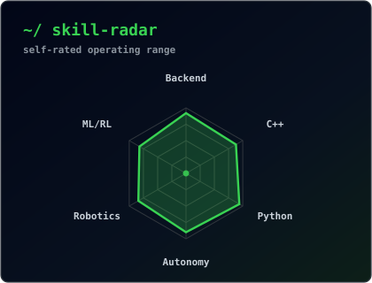
</td>
<td width="50%" align="center" valign="middle">
  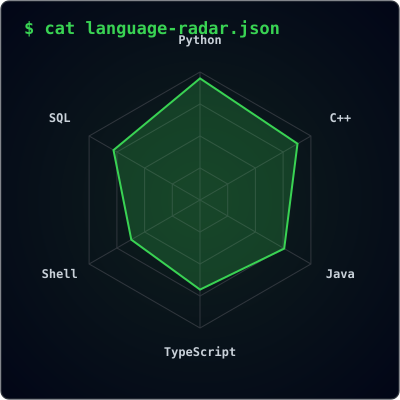
</td>
</tr>
</table>

</div>

---

<div align="center">

## `~/` contribution calendar

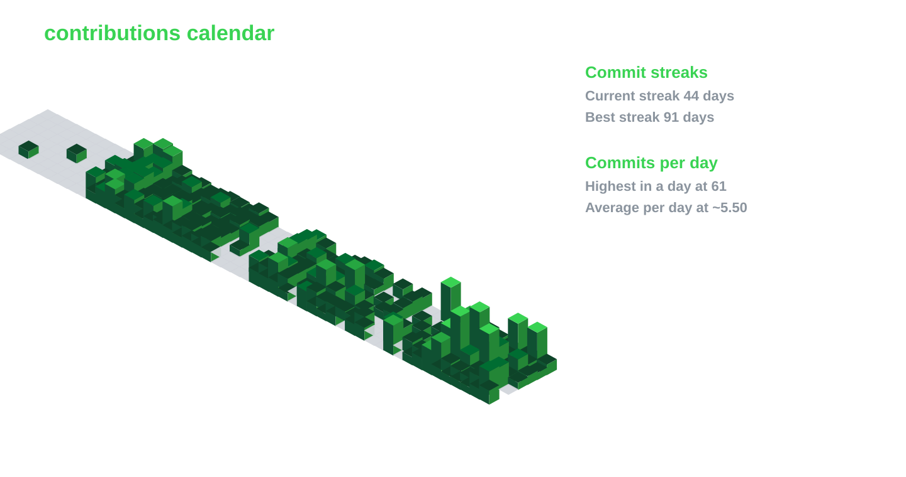

<br><br>


</div>

---

<div align="center">

## `~/` the numbers

<picture>
  <source media="(prefers-color-scheme: dark)" srcset="assets/card-stats-dark.svg">
  <source media="(prefers-color-scheme: light)" srcset="assets/card-stats-light.svg">
  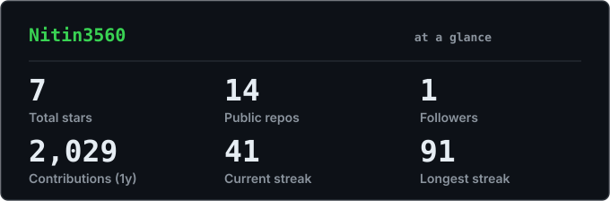
</picture>

<br>

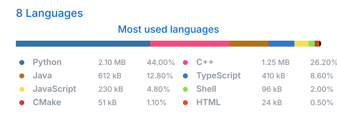

<br><br>

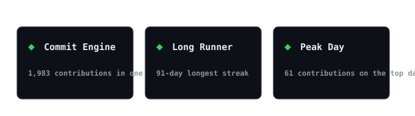

</div>

---

<div align="center">

## `~/` selected work

<table>
<tr>
<td width="50%">
  <a href="https://github.com/Nitin3560/CareerOS">
    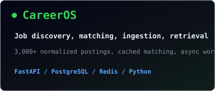
  </a>
</td>
<td width="50%">
  <a href="https://github.com/Nitin3560/TwinGuard">
    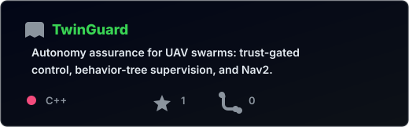
  </a>
</td>
</tr>
<tr>
<td width="50%">
  <a href="https://github.com/Nitin3560/uav-autonomy-research-suite">
    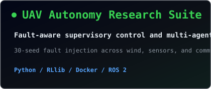
  </a>
</td>
<td width="50%">
  <a href="https://github.com/Nitin3560/traceback-ai">
    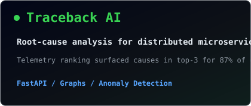
  </a>
</td>
</tr>
</table>

<sub>

| project | focus | stack |
|---|---|---|
| **[CareerOS](https://github.com/Nitin3560/CareerOS)** | job discovery, matching, ingestion, retrieval | `FastAPI` `PostgreSQL` `Redis` `Python` |
| **[TwinGuard](https://github.com/Nitin3560/TwinGuard)** | modular autonomy and fault tolerance for UAVs | `C++17` `ROS 2` `PX4` `Gazebo` |
| **[UAV Autonomy Research Suite](https://github.com/Nitin3560/uav-autonomy-research-suite)** | fault-aware supervisory control and multi-agent RL | `Python` `RLlib` `Docker` `ROS 2` |
| **[Traceback AI](https://github.com/Nitin3560/traceback-ai)** | root-cause analysis for distributed microservices | `FastAPI` `Graphs` `Anomaly Detection` |

</sub>

</div>

---

<div align="center">

<sub>`01110100 01101000 01100001 01101110 01101011 01110011 00100000 01100110 01101111 01110010 00100000 01110011 01100011 01110010 01101111 01101100 01101100 01101001 01101110 01100111`</sub>

</div>
