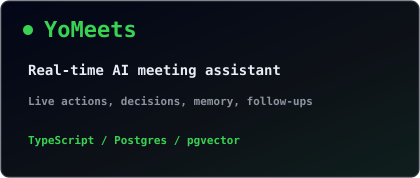

<div align="center">


<br>

<a href="https://github.com/Nitin3560">
  
</a>

<br>

<a href="https://linkedin.com/in/nitin-singh-rathore"></a>
<a href="mailto:nxr3560@mavs.uta.edu"></a>
<a href="https://nitinsinghrathore.us"></a>
<a href="https://github.com/Nitin3560"></a>


</div>

---

## `~/` whoami

```console
$ cat about.txt
```

Hi, I'm **Nitin Singh Rathore**. I build backend systems, autonomy software, and simulation tooling for problems where reliability actually matters.

- MS Computer Science @ **The University of Texas at Arlington**, graduating **December 2026**
- Graduate Teaching Assistant for **C and C++ programming**
- Researching **fault-tolerant control for autonomous UAV swarms**
- Currently seeking **Fall 2026 internships** in autonomy engineering, robotics simulation, or software engineering
- Paper accepted: **IEEE CSCN 2026**, *Integrity-Aware Digital Twin Synchronization for ISAC-Enabled UAV Networks*

<br>

<div align="center">

## `~/` toolbox


</div>

---

<div align="center">

## `~/` skill radar

<table>
<tr>
<td width="50%" align="center" valign="middle">
  
</td>
<td width="50%" align="center" valign="middle">
  
</td>
</tr>
</table>

</div>

---

<div align="center">

## `~/` contribution calendar


<br><br>


</div>

---

<div align="center">

## `~/` the numbers

<picture>
  <source media="(prefers-color-scheme: dark)" srcset="assets/card-stats-dark.svg">
  <source media="(prefers-color-scheme: light)" srcset="assets/card-stats-light.svg">
  
</picture>

<br>


</div>

---

<div align="center">

## `~/` selected work

<table>
<tr>
<td width="50%">
  <a href="https://github.com/Nitin3560/CareerOS">
    
  </a>
</td>
<td width="50%">
  <a href="https://github.com/Nitin3560/TwinGuard">
    
  </a>
</td>
</tr>
<tr>
<td width="50%">
  <a href="https://github.com/Nitin3560/uav-autonomy-research-suite">
    
  </a>
</td>
<td width="50%">
  <a href="https://github.com/Nitin3560/YoMeets">
    
  </a>
</td>
</tr>
</table>

<br>

<table>
<tr>
<th>project</th>
<th>repo</th>
<th>stack</th>
</tr>
<tr>
<td><a href="https://github.com/Nitin3560/CareerOS">CareerOS</a></td>
<td><a href="https://github.com/Nitin3560/CareerOS">source</a></td>
<td><code>FastAPI</code> <code>Postgres</code> <code>Redis</code> <code>Python</code></td>
</tr>
<tr>
<td><a href="https://github.com/Nitin3560/TwinGuard">TwinGuard</a></td>
<td><a href="https://github.com/Nitin3560/TwinGuard">source</a></td>
<td><code>C++17</code> <code>ROS 2</code> <code>PX4</code> <code>Gazebo</code></td>
</tr>
<tr>
<td><a href="https://github.com/Nitin3560/uav-autonomy-research-suite">UAV Autonomy Research Suite</a></td>
<td><a href="https://github.com/Nitin3560/uav-autonomy-research-suite">source</a></td>
<td><code>Python</code> <code>RLlib</code> <code>Docker</code> <code>ROS 2</code></td>
</tr>
<tr>
<td><a href="https://github.com/Nitin3560/YoMeets">YoMeets</a></td>
<td><a href="https://github.com/Nitin3560/YoMeets">source</a></td>
<td><code>TypeScript</code> <code>Postgres</code> <code>pgvector</code></td>
</tr>
</table>

</div>
